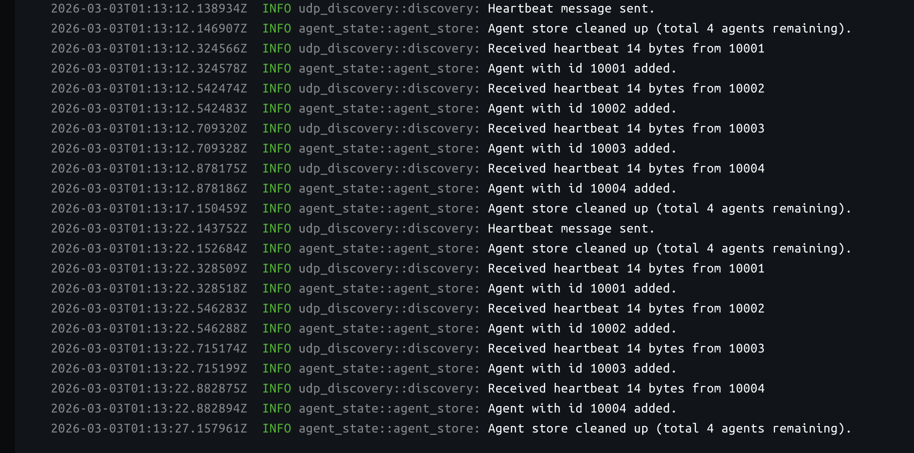
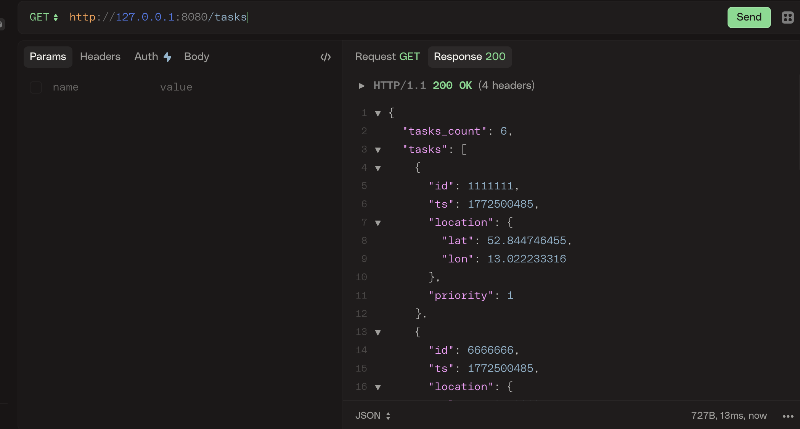
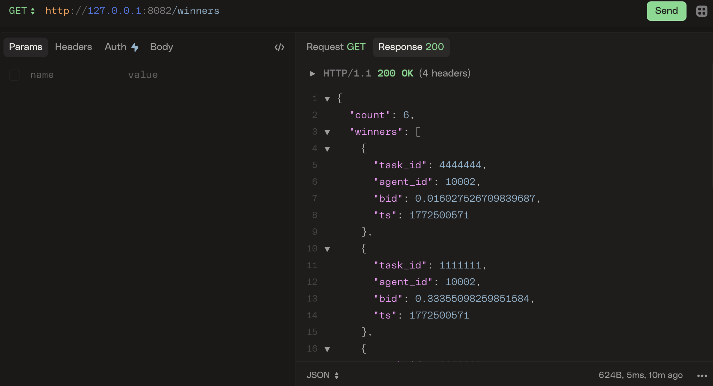

<div class="meta-data">04 mar 2026 </div>

# Implementing a Minimal CBBA Prototype in Rust

## Motivation
I’ve been exploring decentralized task allocation systems, 
particularly the Consensus-Based Bundle Algorithm (CBBA), 
as part of a broader interest in multi-agent coordination.

Rather than starting with simulations or formal proofs, 
I wanted to build a small working prototype that exercises the mechanics of:

- Agent discovery
- Task distribution
- Bundle building
- Consensus messaging

The goal of this project is not to provide a production-ready CBBA implementation, but to create a minimal, 
inspectable system that demonstrates how such agents can be structured in practice,
and later extended toward embedded system deployments.

## Example
Here is a simplified example with 3 agents to give a basic idea.

Let’s assume we have 3 agents and 4 tasks, 
where each agent has different costs for performing each task. 
The goal is to assign the tasks to agents with minimal total cost.

Assume we we have the following cost information:

| Task | Agent 1 | Agent 2 | Agent 3 |
| ---- | ------- | ------- | ------- |
| 1    | 3       | 1       | 2       |
| 2    | 4       | 3       | 1       |
| 3    | 6       | 5       | 4       |
| 4    | 2       | 7       | 3       |

Then the simplified version of the algorithm works like the following:

### Initialization
Each agent starts by considering all tasks it can perform and calculates the cost for each task.

- Agent 1: 
    - `Bundle =  [T1, T2, T3, T4]`
    - `Winners = [T1:(A1,3), T2:(A1,4), T3:(A1,6), T4:(A1,2)]`,
- Agent 2: 
    - `Bundle =  [T1, T2, T3, T4]`
    - `Winners = [T1:(A2,1), T2:(A2,3), T3:(A2,5), T4:(A2,7)]`,
- Agent 3: 
    - `Bundle =  [T1, T2, T3, T4]`
    - `Winners = [T1:(A3,2), T2:(A3,1), T3:(A3,4), T4:(A3,3)]`,

### Step 1

Assume Agent 1 broadcasts its winners list and
Agent 2 and Agent 3 recieve the gossip (the winners list).
They resolve conflicts (lower cost wins) and update their bundle and winners list.

- Agent 1: `B = [T1, T2, T3, T4], W = [T1:(A1,3), T2:(A1,4), T3:(A1,6), T4:(A1,2)]`
- Agent 2: `B = [T1, T2, T3], W = [T1:(A2,1), T2:(A2,3), T3:(A2,5), T4:(A1,7)]`
- Agent 3: `B = [T1, T2, T3], W = [T1:(A3,2), T2:(A3,1), T3:(A3,4), T4:(A1,2)]` 

So, Agent 2 and Agent 3 drop the Task 4 and update their winners accordingly.
This process continues until all agents agree upon a common list of winners.

## Agent State Model

Each agent maintains several internal stores that together represent its view of the world.

### Agent Store

Agent tracks discovered peers. 
The agent store is populated via the discovery background task.

Typical contents:

- Agent ID
- IP (transport) address
- Last heartbeat timestamp

This allows agents to dynamically learn who is participating without pre-configuration.

### Task Store

Represents all known tasks distributed to the agent.
This is the agent’s source of truth for available work.
Tasks are inserted via control commands such as task distribution events.

### Bundle
The bundle represents the ordered set of tasks the agent is currently bidding on / planning to execute.

In CBBA terminology:

> The bundle is the agent’s locally optimal task sequence given its scoring function.

This demo keeps bundle construction simple — tasks are appended greedily based on score.
The bundle is updated as agents exchange bid information.

### Winners Table

The winners table stores consensus knowledge:

- Winning agent per task
- Winning bid value
- Associated timestamps

This table is updated as agents exchange bid information.

## Background Tasks

Each agent runs several background tasks that operate independently of the consensus loop.

This keeps the system reactive and modular.

### Discovery Server

Responsible for peer discovery. It

- Periodically broadcasts heartbeat messages
- Listens for heartbeats from others
- Updates the agent store
- Removes stale peers after timeout

This enables a dynamic network where agents can appear or disappear.

### Control Server

The control server acts as the primary command interface.

It parses incoming commands, which may originate from:

- Manual operator input
- Other agents

Once parsed, commands trigger state transitions in the agent.

### State Server

A lightweight HTTP server exposes agent state for inspection.
All endpoints are read-only (GET) allowing querying:

- Current bundle
- Known peers
- Task store contents
- Consensus winners
- Configuration
- Current state

It functions primarily as a debugging / observability tool.

## Agent Finite State Machine

The agent itself is modeled as a finite state machine (FSM).
Commands drive transitions between states.
The current implementation has the following states:

- Idle
- Running CBBA
- RunningDistTasks

```rust
pub enum ControlState {
    Idle,
    RunningCBBA,
    RunningDistTasks,
}
```

If a command conflicts with the current state, the transition is rejected and an error is returned.

This prevents invalid flows such as:

- Starting consensus before tasks exist
- Redistributing tasks mid-consensus

The FSM keeps agent behavior predictable and easier to reason about.

## Communication Model

The demo uses UDP for all inter-agent messaging.
This choice was deliberate.

Pros:

- Simple to implement
- Low overhead
- Suitable for broadcast discovery

Cons:

- No delivery guarantees
- No ordering guarantees
- No retransmission

Because of this, the system relies on:

- Periodic rebroadcasts
- Timestamp comparison
- Idempotent state updates

This keeps the prototype lightweight while still exercising distributed coordination logic.

## Running the Demo
A typical flow looks like:

1. Agents start
2. Discovery populates peer lists
3. Tasks are distributed via control command
4. Agents build initial bundles
5. Consensus messages propagate
6. Winners converge

State can be inspected at any time via the HTTP state server.

Currently the CBBA is implemented very simply. 
Every agent simply runs the entire CBBA process for 30 seconds and quits the CBBA phase.
You can find the full implementation together with demos and Docker and docker-compose files [here](https://github.com/fade2black/agent-project).







## Next Steps

Currently I have been impementing discovery on the embedded system - ESP32-C6.
I am also planning to read about the convergence time (*Consensus-Based Decentralized Auctions for Robust Task Allocation*) and choose CBBA timeout time wisely. Integrating encrypted transport is also possible. I am also planing to study and implement other swarm algorithms for autonimous agents.
