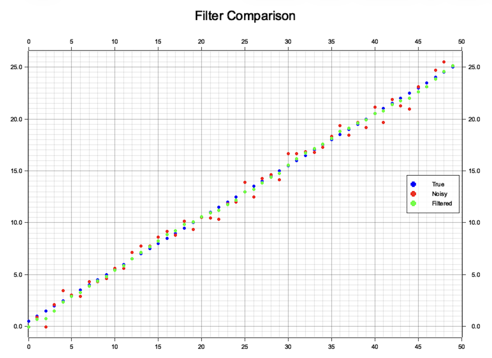
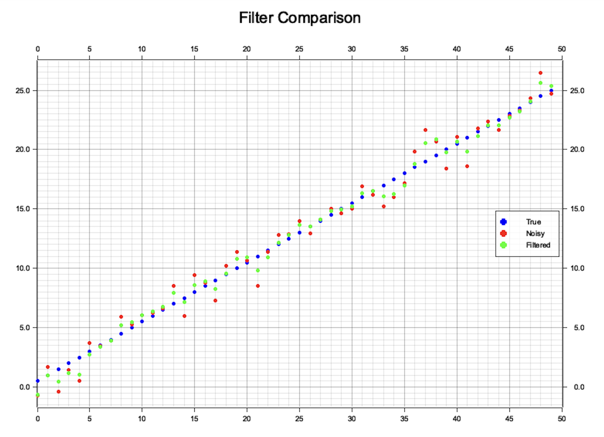

<div class="meta-data">07 apr 2026 </div>

# A Gentle Introduction to Kalman Filters (1D Kalman Filter )

I’ve been playing around with state estimation lately, specifically how to track an object moving 
in 1D at a constant velocity $v$ using only a noisy sensor (like a basic GPS). 
We can assume the objcts moves along the $x$ axis.
To get a clean estimate of the position, I'm using a 1D Kalman Filter to bridge the gap between
my physics model and the messy real-world data. 

At its core, a Kalman Filter is just an iterative loop that balances "what should happen" against 
"what the sensor says." 
It first predicts where the object will be based on its velocity, then corrects that guess when a new measurement arrives. By tuning two noise parameters - $Q$ for the process and $R$ for the sensor - the filter gives us a much more accurate result than either the model or the sensor could provide on their own.

# Basic Ingredients of a Kalman Filter

 In simple terms, a Kalman filter has the following three ingrdients:

 1. **State**: The variable we are tracking (in this case, position).
 2. **Model**: Our physics-based "best guess" of how the object moves (e.g. $x = v \cdot dt$).
 3. **Measurement** : The noisy data coming from our actual sensor.
 4. **Noise**: Constants $Q$ and $R$ that represent how much we "trust" our model and our sensor respectively.
 
 The filter runs in a continuous loop consisting of two main steps:

 1. **Predict**: We use our constant velocity $v$ and the time step $dt$ to project where the object should be.
 2. **Update**: When a new sensor reading arrives, the filter makes some calculations. If the sensor is reliable, the filter pulls our estimate toward the measurement. If the sensor is noisy, it leans more on our physics prediction.
 
 By repeating this cycle, the filter "smooths" out the noise and provides 
 a much more accurate track than the raw sensor data alone. 

 At first it might feel a bit abstract, but the next example will make the core idea of the Kalman filter much clearer.

# Design a Kalman Filter

## State
The only qunatity we track is the object's position $x$. 
In a perfect world, we would know the object's position exactly (e.g., $x = 10.0$).
But in reality, sensors are "noisy" and models are "fuzzy."

To handle this, the Kalman filter represents the state as a Gaussian (Normal) distribution.
Instead of a single point, we think of the position as a "bell curve" defined by two values:

- The **Mean** ($\mu$) : Our best estimate of where the object is.
- The **Variance** ($\sigma ^{2}$): How "sure" we are. A tall, skinny curve means we are very confident. A short, fat curve means we are uncertain. In other words, the bigger the variance the less we trust in our model or measurement.

So, let's denote our state $x$ as a pair $(\mu, \sigma^2)$.

Why Gaussians?

I am not going to dive into math heavy details,
but the "magic" of the Kalman filter is that when we combine two Gaussians 
(our prediction and our measurement), the result is always another Gaussian.
In other words, the sum and product of two Gaussians distributions is again
is Gaussian and combining $\sigma$s and $\mu$s is computationally cheap. 

## Model
The model for motion along $x$ with a constant velocity $v$ is straightforward.
If $x_0$ is initial displacement and we time is $dt$ then our new displacement is simply

$$x_0 + v\cdot dt$$

## Noise

Kalman filter takes into account also how much we trust in our model and the measurement. 
This is done using two noise parameters $R$ and $Q$. $R$ denotes how much we trust
in we in measurements, while $Q$ denotes how much we trust in our physical model.

If $R$ is quite bigger than $Q$ then the filter thinks the sensor is garbage and will mostly follow the model prediction. On the other hand, if $Q$ is quite bigger than $R$ then the filter thinks the physics model is unreliable and will jump to follow every tiny movement the sensor reports.

We will choose fixed $R$ and $Q$ in our implementation.

## Time Update (Prediction)

In Time update we using our physics model predict where the object has moved.
In our 1D constant-velocity model it is very simple

$$\mu_k = \mu_{k-1} + v\cdot dt$$

and uncertainty also grows 

$$\sigma^2_k = \sigma^2_{k-1} + Q$$

By the end of the prediction step, we have an "a priori" estimate 
or in simple words "our best guess before we have seen the latest sensor data."

## The Measurement Update (Correction)

Now that we have our physics based prediction, it is time to take into account real measurement.

The purpose of the Measurement Update is to take the actual sensor reading and use it to refine our prediction. This step is where the "filtering" actually happens through three quick calculations:

The **Kalman Gain** ($K$): We calculate a weight between 0 and 1. This determines if we should trust our prediction (low $K$) or the new sensor data (high $K$).

$$K = \frac{\sigma^2}{\sigma^2 + R}$$

The **State Update**: we adjust our position $\mu$ based on the difference ("residual") between what we expected to see and what the sensor actually saw ($z$).

$$ \mu_{new} = \mu + K(z - \mu)$$

The **Covariance Update**: Finally, because we've just gained new information from a sensor, our uncertainty ($\sigma ^{2}$) decreases.

$$ \sigma^2_{new} = (1 - K) \cdot \sigma^2$$

By the end of this step, we have an "a posteriori" estimate. 
In other words, our final, polished answer for this time step. 
The filter then loops back to TIme Updatep 1 and starts the whole
 process over again for the next $dt$.

# Rust Implementation

```rust
pub struct State {
    pub mu: f64,
    pub sigma2: f64,
}

pub struct KalmanFilter1D {
    process_noise: f64,
    measurement_noise: f64,
    dt: f64,
    v: f64,
}

impl KalmanFilter1D {
    pub fn new(process_noise: f64, measurement_noise: f64, dt: f64, v: f64) -> Self {
        KalmanFilter1D {
            process_noise,
            measurement_noise,
            dt,
            v,
        }
    }

    pub fn update(&self, state: State, meas: f64) -> State {
        let state = self.predict(state);
        self.correct(state, meas)
    }

    fn predict(&self, state: State) -> State {
        let dx = self.v * self.dt;
        let mu = state.mu + dx;
        let sigma2 = state.sigma2 + self.process_noise;

        State { mu, sigma2 }
    }

    fn correct(&self, state: State, meas: f64) -> State {
        let gain = state.sigma2 / (state.sigma2 + self.measurement_noise);
        let mu = state.mu + gain * (meas - state.mu); // Correct the position
        let sigma2 = (1.0 - gain) * state.sigma2; // Update uncertainty

        State { mu, sigma2 }
    }
}
```

I did simulation for different values of $Q$ and $R$ by generating
true and noisy positions by setting the constant velocity $v$ to $1$,
time step $dt$ to $0.5$, total time steps to $50$ and plotted 
true, noisy and filtered poistions.

**Simulation 1**: $Q=0.04$ (process noise), $R=0.64$ (measurement noise).
Notice that $R > Q$ so the filter trusts the model rather than measurements.


Because I have generated true positions using our physics-based formula and the filter trusts
the model more than the measurement, the true and filtered points almost coincide.   


**Simulation 2**: $Q=0.64$ (process noise), $R=1.0$ (measurement noise).
Notice that $R$ is only slightly less than $Q$.

